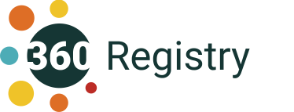

# 360Giving Quality Dashboard



The [360Giving Quality Dashboard](http://qualitydashboard.threesixtygiving.org) shows features and quality of data that uses the [360Giving Standard](http://standard.threesixtygiving.org). The list of files is maintained by 360Giving, and this repo contains the source code for the website.


Note: This repository is in flux while two projects are seperated. See registry-vue README for Quality Dashboard readme.

Install dependencies:

```bash
python3 -m venv .ve
source .ve/bin/activate
pip install -r requirements_dev.txt
```

This project uses pip-tools. To update the requirements files, run:

```bash
pip-compile requirements.in
# or
pip-compile requirements_dev.in
```

This project uses PyScss. To update the compile css file, run:

```bash
pysassc registry/sass/main.scss registry/static/css/theme.css
```

To run the registry tests:
```bash
python -m pytest tests/
```

To run the dashboard tests:
```bash
MODE='dashboard' python -m pytest tests_dashboard/
```

In order to run the application see the relevant commands below:

**Development**
```bash
export FLASK_APP=registry/views.py
export FLASK_ENV=development
python -m flask run
```

**Server**
```bash
export FLASK_APP=registry/views.py
python -m flask run
```
